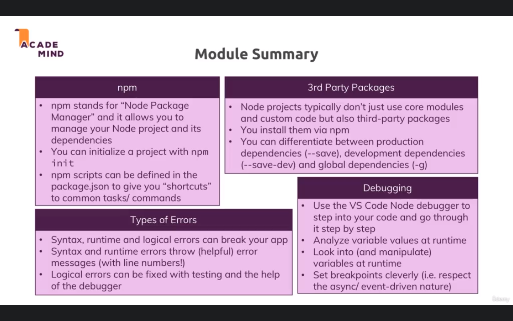

- npm : Node package manager we can add 'Third-party Modules'.
- npm init : to add package.json File , for package name , description , author , etc...
- you can edit package.json and add some feature as `start` in script part .
- to install nodemon `npm i nodemon --save-dev` as a development dependency.
- Core Node.js Modules don't need to be installed (NO npm install is required) but you need to import them when you want to use features exposed by them.

## Errors :

- syntax
- RunTime errors.
- Logical Errors.

## added configurations to debugger:

```
  "configurations": [
    {
      "type": "node",
      "request": "launch",
      "name": "Launch Program",
      "program": "${workspaceFolder}/app.js",
      "resart": true,
      "runtimeExecutable": "nodemon",
      "console": "integratedTerminal"
    }
  ]
```

## summary :


