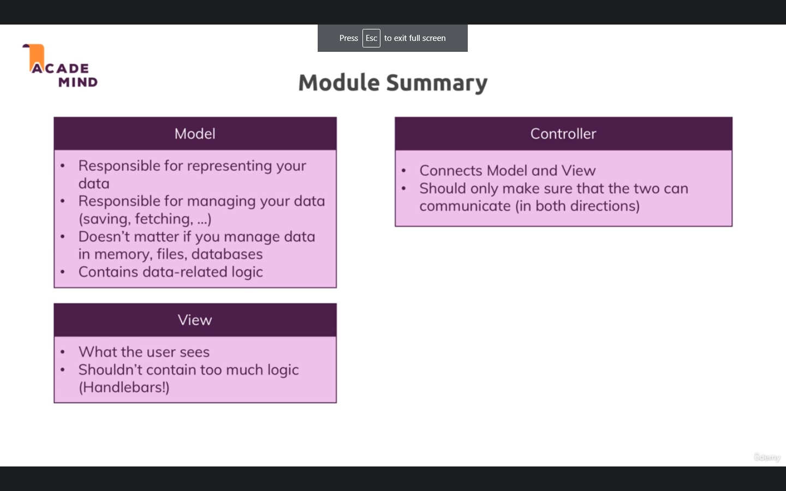

# Model View Controller MVC

• MVC : separation of concerns , making sure that different of your code do differnet things and you clearly know which part is responsible for what.

• model :

- objects or part of code that is responsible for representing your data.
- work with data , save , fetch data .

• views : what users see.

• Controller : connection between model and views. in between logic

## controller :

• we create controllers folder that hold all logic .
• we export our function .
`exports.functionName= (req,res,next) ...`
then we require it in app.js as usual.

## models :

